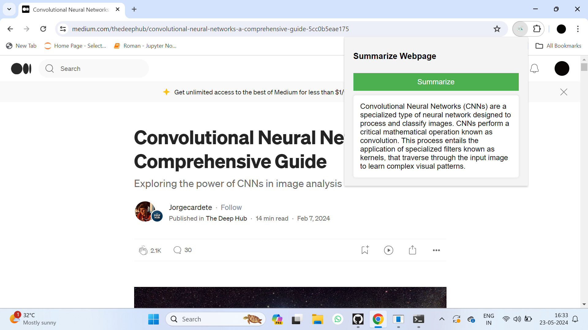

# Website-Summarizer-Chrome-Extension

## Overview
The **Website Data Summarizer** is a Chrome extension designed to extract and summarize content from webpages. This extension leverages advanced natural language processing capabilities to provide concise summaries of lengthy articles, making it easier for users to grasp the main points quickly.

## Features
- **Content Summarization**: Automatically extracts and summarizes the main content from any webpage.
- **Easy to Use**: With a simple click of a button, users can get a summarized version of the webpage content.
- **Background Processing**: The extension uses background scripts to handle summarization, ensuring a smooth user experience.

## Screenshots
### Extension Popup

*Screenshot 1 .*

!(2024-05-23 (2).png)
*Screenshot 2.*

!(2024-05-23 (3).png)
*Screenshot 3*

## Installation
1. Clone the repository:
    ```sh
    git clone https://github.com/yourusername/website-summarizer-chrome-extension.git
    ```
2. Open Chrome and navigate to `chrome://extensions/`.
3. Enable "Developer mode" by toggling the switch in the upper right corner.
4. Click "Load unpacked" and select the cloned repository folder.
5. The extension is now installed and ready to use.

## Usage
1. Navigate to any webpage you want to summarize.
2. Click on the extension icon in the Chrome toolbar.
3. In the popup window, click the "Summarize" button.
4. Wait for the summarization process to complete and view the summary in the popup window.

## Technical Details
- **Manifest Version**: 3
- **Permissions**: `activeTab`, `scripting`, `storage`
- **Background Service Worker**: `background.js`
- **Content Scripts**: `content.js`
- **Options Page**: `options.html`
- **Default Popup**: `popup.html`
- **API Integration**: Utilizes Hugging Face's BART model for text summarization.

## How it Works
1. The user clicks the "Summarize" button in the popup.
2. The extension injects a content script into the active tab to extract the main content.
3. The extracted content is sent to the background script.
4. The background script makes a request to a Flask server that interfaces with Hugging Face's BART model to generate a summary.
5. The summary is sent back to the extension and displayed in the popup.

## Contributing
We welcome contributions from the community. Please fork the repository and submit pull requests for any features, bug fixes, or improvements.

## License
This project is licensed under the MIT License. See the [LICENSE](LICENSE) file for details.
